+++
categories = ['learning notes']
date = '2025-08-16'
metaRobots = 'noindex, nofollow'
slug = 'data-cleaning-in-mysql-8.0-note'
tags = ['SQL', 'data cleaning']
title = 'My First SQL Data Cleaning Project using MySQL 8.0 - Learning Note'
+++

# Data Cleaning in MYSQL 8.0
This is an **documentation of the full workflow** of data cleaning in MySQL 8.0. To see the review/summary of this project, click here:
- **[Data Cleaning in MySQL 8.0]()**.

<hr>

## Introduction

When working with real-world datasets, it's common to encounter issues like duplicate rows, inconsistent formatting, and missing values. In this tutorial, I’ll walk through how I followed the data cleaning process demonstrated by **Alex the Analyst**, using **MySQL 8.0.43**. The focus areas include:
- Removing duplicates
- Standardizing data
- Handling null and blank values
- Dropping unnecessary columns or rows

<hr>

### Step 1: Creating a Duplicate of the Original Dataset

After importing the original dataset (`layoffs`), I created a staging table to work on. This staging table acts as a working copy, allowing me to perform data cleaning and transformations without affecting the original data.

To duplicate the structure of the original table, I used the following query. It creates a new table (`layoffs_staging`) with the same columns as the `layoffs` table:

```mysql
CREATE TABLE layoffs_staging;
LIKE layoffs;
```

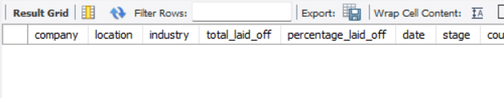

Once the table was created, I copied all the data from the original table into the staging table using this query:

```mysql
INSERT layoffs_staging
SELECT *
FROM layoffs;
```

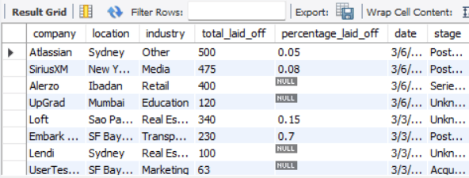

<hr>

### Step 2: Removing Duplicate Rows

#### Using `ROW_NUMBER()` to Identify Duplicates

>**Why Am I Using** `ROW_NUMBER()` **and Creating a** `row_num` **Column?**
>    This dataset doesn’t include a unique identifier like a primary key for each layoff record. To detect and eventually remove duplicate rows, I rely on `ROW_NUMBER()` to distinguish between identical entries based on shared attributes.

To identify duplicate rows in the dataset, I used the `ROW_NUMBER()` function. This function assigns a unique integer to each row within a result set, based on the specified ordering or grouping. It’s especially useful for tasks like ranking, grouping, and paginating data. [^1]

```mysql
SELECT *,
    ROW_NUMBER() OVER (
        PARTITION BY company, location, industry, total_laid_off, percentage_laid_off, `date`, stage, country, funds_raised_millions
        ) AS row_num
FROM layoffs_staging;
```

In this query, the `OVER()` clause defines the window of operation. Specifically, I used `PARTITION BY` to group rows based on shared attributes such as company, location, industry, and other relevant columns. This allows `ROW_NUMBER()` to assign a unique number to each row within those partitions.

The query adds a new column called `row_num` using the `AS` keyword. This column helps me identify which rows are duplicates by assigning a sequential number to each group of similar rows.

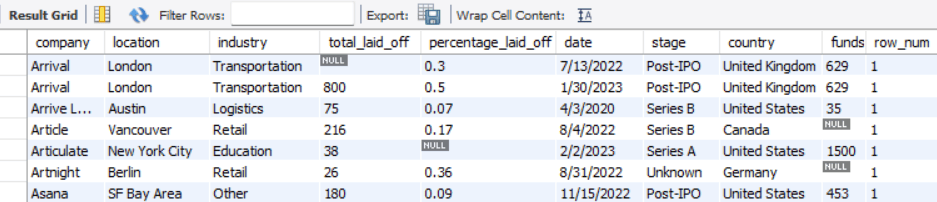


#### Using CTE to Filter Duplicates

To make the process of identifying duplicates more structured and readable, I used a **Common Table Expression (CTE)**. A CTE is a named temporary result set that simplifies complex queries and improves both readability and reusability. [^2]

CTEs are introduced using the `WITH` keyword, followed by the name of the CTE. In this case, I named it `duplicate_cte`.

```mysql

WITH duplicate_cte AS (
    SELECT *,
        ROW_NUMBER() OVER (
            PARTITION BY company, location, industry, total_laid_off, percentage_laid_off, `date`, stage, country, funds_raised_millions
            ) AS row_num
    FROM layoffs_staging
)
SELECT *
FROM duplicate_cte
WHERE row_num > 1;
```

This query first assigns a `row_num` to each row using the same logic as before. Then, by applying a `WHERE` clause, I filter out rows where `row_num` is greater than 1, these are considered duplicates within their respective partitions.

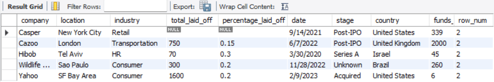

#### Creating a New Table to Delete Duplicates

Since I can't delete rows directly from the result of a Common Table Expression (CTE), I created a new table called `layoffs_staging2`. This table includes an additional column, `row_num`, which will help me identify and remove duplicate entries.

To do this, I followed the tutorial’s instructions and copied the `CREATE TABLE` statement by right-clicking on the original table in my database interface.

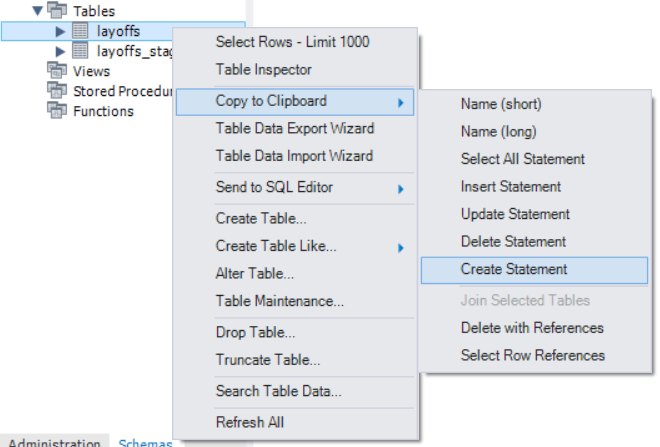

Here’s the modified `CREATE TABLE` statement, where I manually added the `row_num` column:

```mysql create statement
CREATE TABLE `layoffs_staging2` (
  `company` text,
  `location` text,
  `industry` text,
  `total_laid_off` int DEFAULT NULL,
  `percentage_laid_off` text,
  `date` text,
  `stage` text,
  `country` text,
  `funds_raised_millions` int DEFAULT NULL,
  `row_num` INT /* Added in */
) ENGINE=InnoDB DEFAULT CHARSET=utf8mb4 COLLATE=utf8mb4_0900_ai_ci;
```

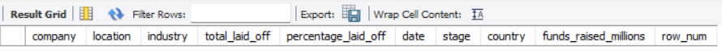

Once the table structure was ready, I populated it using the following query. This query copies all rows from `layoffs_staging` and calculates the `row_num` for each row based on the same partitioning logic used earlier:

```mysql
INSERT INTO layoffs_staging2
SELECT *,
    ROW_NUMBER() OVER (
        PARTITION BY company, location, industry, total_laid_off, percentage_laid_off, `date`, stage, country, funds_raised_millions
        ) AS row_num
FROM layoffs_staging;
```

This setup allows me to safely delete duplicate rows from `layoffs_staging2` without affecting the original dataset or relying on temporary query results.


#### Finally Deleting the Duplicate Rows
Now that I’ve populated the `layoffs_staging2` table and identified duplicate rows using the `row_num` column, the final step is to delete those duplicates.

To ensure accuracy, I first run a `SELECT` query to preview all rows where `row_num` is greater than 1. These are the duplicate entries within each partition:

```mysql
/* Fetch Duplicated Rows First */
SELECT *
FROM layoffs_staging2
WHERE row_num > 1;
```

Once I’ve confirmed the duplicates, I proceed with the `DELETE` operation to remove them:

```mysql
/* Delete Duplicated Rows */
DELETE
FROM layoffs_staging2
WHERE row_num > 1;
```

After the deletion, I run the same `SELECT` query again to verify that all duplicate rows have been successfully removed:

```mysql
/* Check if There's Still Duplicated Rows Left*/
SELECT *
FROM layoffs_staging2
WHERE row_num > 1;
```


<hr>

### Step 3: Standardizing Data

#### Trimming Whitespace & Trailing

To ensure consistency across the dataset, I used the `TRIM()` function to remove any leading or trailing whitespace from values. This is important because extra spaces can cause issues when filtering, joining, or comparing data.

Here are a few examples of how whitespace can appear in raw data:
- `' XXX'`
- `'XXX '`
- `' XXX '`

To clean up all columns in the `layoffs_staging2` table, I first ran a `SELECT` query to review the current state of the data

Then, I applied the `TRIM()` function to each relevant column using an `UPDATE` statement:

```mysql
/* Preview All Columns */
SELECT *
FROM layoffs_staging2;

/* Trimming All Columns */
UPDATE layoffs_staging2 SET 
company = TRIM(company), 
location = TRIM(location),
industry = TRIM(industry),
total_laid_off = TRIM(total_laid_off),
percentage_laid_off = TRIM(percentage_laid_off),
`date` = TRIM(`date`),
stage = TRIM(stage),
country = TRIM(country),
funds_raised_millions = TRIM(funds_raised_millions);
```


#### Renaming Inconsistent Values

##### Industry Column
Next, I moved on to cleaning up the `industry` column. To begin, I fetched all distinct values in ascending order, including any nulls or blanks:

```mysql
/* Checking Industry Column */
SELECT DISTINCT industry
FROM layoffs_staging2
ORDER BY 1;
```

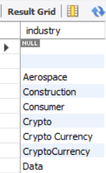

Just by looking at the results, I could already spot a few issues. The column contained nulls, empty strings, and inconsistently named entries such as:
- `Crypto` , `CryptoCurrency` , `Crypto Currency` 

To standardize these values, I decided to rename all entries that start with `'Crypto%'` to simply `'Crypto'`. Here’s the query I used:

```sql
/* Fetch All Rows with Crypto% Industry */
SELECT *
FROM layoffs_staging2
WHERE industry LIKE 'Crypto%';

/* Rename the Crypto% to Crypto */
UPDATE layoffs_staging2
SET industry = 'Crypto'
WHERE industry LIKE 'Crypto%';
```

##### Country Column
I noticed a similar issue in the `country` column. After running a query to inspect the values, I found inconsistencies like `'United States of America'`, `'United States (USA)'`, and other variations.

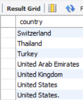

To clean this up, I standardized all entries that begin with `'United States'` to simply `'United States'` using the following query:

```mysql

/* Fetch All Rows with United States% Industry */
SELECT *
FROM layoffs_staging2
WHERE country LIKE 'United States%';

/* Rename the United States% to United States */
UPDATE layoffs_staging2
SET country = 'United States'
WHERE country LIKE 'United States%';
```
##### Reformatting Dates
Finally, I addressed the formatting of the `date` column. The goal was to convert all string-based dates into a proper date format using `STR_TO_DATE()`.

First, I reviewed the current values. Then, I applied the transformation using `STR_TO_DATE()` operation:

```mysql
SELECT `date`
FROM layoffs_staging2;

UPDATE layoffs_staging2
SET `date` = STR_TO_DATE(`date`,'%m/%d/%Y')
```

<hr>

### Step 4: Handling Null and Blank Values

#### Deleting Nulls


Some rows are missing critical data like `total_laid_off` and `percentage_laid_off`. Ideally, we could recover these values using formulas like:

- `total_laid_off = percentage_laid_off * total_employees`
- `percentage_laid_off = total_laid_off / total_employees`

However, since we don’t have the `total_employees` data, we’ll go ahead and delete these rows for now. In a real-world scenario, it would be better to consult another department to try and recover this data.

```mysql
DELETE
FROM layoffs_staging2
WHERE total_laid_off IS NULL OR percentage_laid_off IS NULL;
```


##### Replacing Blanks with  Data
First, I checked for blank or null values in the `industry` column:

```mysql
SELECT *
FROM layoffs_staging2
WHERE industry IS NULL OR industry = '';
```

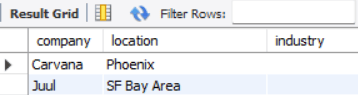

Turns out, two companies—**Carvana** and **Juul**, had blank entries. To fix this, I searched for other rows with the same company name to find a reference industry:

```mysql
SELECT *
FROM layoffs_staging2
WHERE company = 'Carvana' OR company = 'Juul'
```

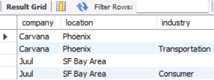

To address blank values in the `industry` column, I leveraged a **self-join** method. The idea was to use existing rows with valid industry references to fill in missing values for the same company. 

First, I previewed the join to confirm that matching rows existed:

```mysql
SELECT t1.industry, t2.industry
FROM layoffs_staging2 AS t1
JOIN layoffs_staging2 AS t2
	ON t1.company = t2.company
WHERE t1.industry IS NULL
AND t2.industry IS NOT NULL;
```

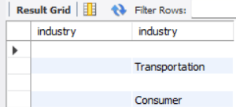

Before performing the update, I standardized the data by converting all blank strings in the `industry` column to `NULL`. This made it easier to identify missing values consistently:

```mysql
UPDATE layoffs_staging2
SET industry = NULL
WHERE industry = '';
```

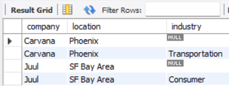

With the blanks now represented as `NULL`, I executed the **self-join** update. For each row in `t1` with a missing industry, the query finds a corresponding row in `t2` with the same company name and a known industry, then fills in the missing value:

```mysql
UPDATE layoffs_staging2 AS t1
JOIN layoffs_staging2 AS t2
	ON t1.company = t2.company
SET t1.industry = t2.industry
WHERE t1.industry IS NULL
AND t2.industry IS NOT NULL;
```

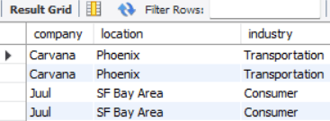

<hr>

### Step 5: Dropping Unnecessary Columns or Rows
##### Removing the `row_num` Column

Now that the data cleaning is complete, I removed the `row_num` column, which was previously used to identify and delete duplicate rows.

```mysql
ALTER TABLE layoffs_staging2
DROP COLUMN row_num;
```

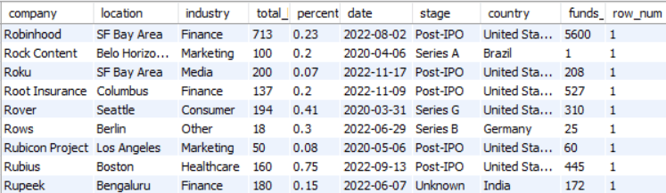

#### Done!